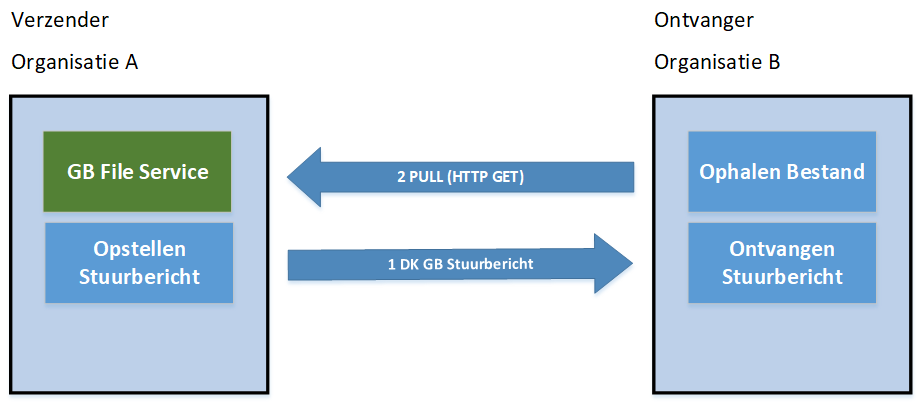
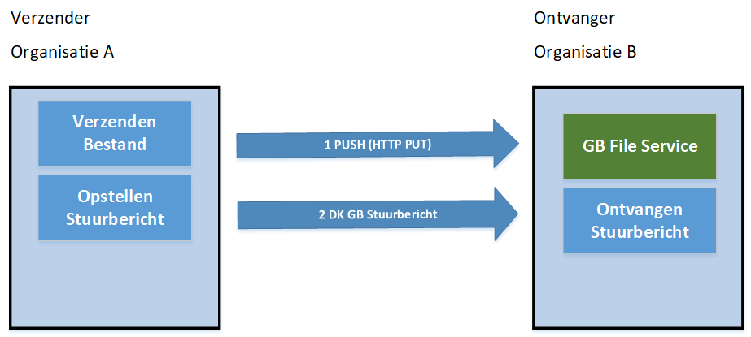

# Inleiding

## Doel en doelgroep

Dit document beschrijft de functionele specificaties voor de Digikoppeling
koppelvlakstandaard Grote Berichten, onderdeel van Digikoppeling.

Het document is bestemd voor architecten en ontwikkelaars die op basis van
Digikoppeling Grote Berichten gegevens willen uitwisselen. Zie onderstaande
tabel bij welke taken dit document ondersteunt. Alle webservices die op Grote
Berichten gebaseerd zijn, moeten conformeren aan de koppelvlakstandaard Grote
Berichten. Deze wordt tot in detail in dit document gespecificeerd. Het doel van
dit document is ontwikkelaars te informeren wat deze koppelvlakstandaard nu
precies inhoudt en waar zij zich aan moeten conformeren. Het gaat hierbij om
zowel (service) aanbieders als (service) afnemers.

| Afkorting | Rol                             | Taak                                                                                                       | Doelgroep? |
|-----------|---------------------------------|------------------------------------------------------------------------------------------------------------|------------|
| [MT]      | Management                      | Bevoegdheid om namens organisatie (strategische) besluiten te nemen.                                       | **Nee**    |
| [PL]      | Projectleiding                  | Verzorgen van de aansturing van projecten.                                                                 | **Nee**    |
| [A&D]     | Analyseren & ontwerpen (design) | Analyseren en ontwerpen van oplossings-richtingen. Het verbinden van Business aan de IT.                   | **Ja**     |
| [OT&B]    | Ontwikkelen, testen en beheer   | Ontwikkelt, bouwt en configureert de techniek conform specificaties. Zorgen voor beheer na ingebruikname.  | **Ja**     |

## Opbouw Digikoppeling documentatie

Digikoppeling is beschreven in een set van documenten. Deze set is als volgt
opgebouwd:

## Doel en scope van Digikoppeling

Digikoppeling biedt de mogelijkheid om op een gestandaardiseerde wijze berichten
uit te wisselen tussen partijen. De uitwisseling tussen partijen wordt in drie
lagen opgedeeld:

- Inhoud: Op deze laag worden de afspraken gemaakt de inhoud van het uit te
    wisselen bericht, dus de structuur, semantiek en waardebereiken.
    Digikoppeling houdt zich **niet** met de inhoud bezig, ‘Digikoppeling heeft
    geen boodschap aan de boodschap’.

- Logistiek: Op deze laag bevinden zich de afspraken betreffende

    transportprotocollen (HTTP), messaging (SOAP), beveiliging

    (authenticatie en encryptie)en betrouwbaarheid. *Dit is de*

    *Digikoppeling-laag.*

- Transport: deze laag verzorgt het daadwerkelijke transport van

    het bericht.

Digikoppeling richt zich dus uitsluitend op de logistieke laag. Deze afspraken
komen in de koppelvlakstandaards en andere voorzieningen. In het geval van WUS
en ebMS2 komt de logistieke laag overeen met de ‘header’ van het bericht en gaat
de ‘body’ uitsluitend over de inhoud. In het geval van Digikoppeling grote
berichten is een deel van de logistieke informatie opgenomen in de ‘body’ van
het bericht in de vorm van gestandaardiseerde meta-data.

### Leidend principe

De koppelvlakstandaarden dienen te leiden tot een maximum aan interoperabiliteit
met een minimum aan benodigde ontwikkelinspanning.

Daarom wordt gekozen voor bewezen interoperabele internationale standaarden.

Digikoppeling maakt berichtenuitwisseling mogelijk op basis van de ebXML/ebMS2
en WUS families van standaarden inclusief de daarbij behorende verwante
standaarden.

Aan te sluiten overheidsorganisaties hebben aangegeven op een uniforme manier
(één stekker) te willen aansluiten aan Digikoppeling. Organisaties die
beschikken over eigen middleware (ESB, Broker, Gateway) kunnen de aansluiting
aan Digikoppeling, de adapters, in het algemeen realiseren via voorzieningen in
die middleware.

De architectuur voor toepassing van Digikoppeling standaard is beschreven in het
document “Digikoppeling\_Architectuur”.

## Koppelvlak & koppelvlakstandaard

Een koppelvlak is een interface die volgens standaarden de gegevensuitwisseling
verzorgt. Het werken met vaste standaarden is essentieel voor een koppelvlak.
Hierdoor wordt implementatie vergemakkelijkt. Ook wordt het mogelijk diverse
soorten berichten door te sturen met een grote mate van interoperabiliteit,
omdat via de standaard afspraken over hun inhoud gemaakt is.

Een van de belangrijkste eisen die door de overheid gesteld worden bij de
inrichting van generieke voorzieningen is dat er niet veel maatwerk ontwikkeld
hoeft te worden, maar dat er van “off the shelf” commercieel of OPEN geleverde
software gebruik gemaakt kan worden. Voor Digikoppeling, dus voor de logistieke
laag, betreft dat het niet willen ontwikkelen van software voor de adapters. Dit
doel kan bereikt (benaderd) worden doordat gekozen wordt voor internationale (de
jure of de facto) vastgelegde standaards, die door “alle” leveranciers
interoperabel zijn geïmplementeerd.

Een andere eis is dat met name afnemers gebruik kunnen maken van één “stekker”
(één logistiek koppelpunt).

### Specificatie van de koppelvlakstandaard

De koppelvlakspecificatie beschrijft de eisen waar de adapters aan moeten
voldoen om interoperabel met elkaar te kunnen communiceren.

De Digikoppeling Grote Berichten Standaard beschrijft dan ook niet de inhoud van
het grote bericht. Wel richt de standaard zich op de beschrijving (metadata) van
het grote bericht.

## Opbouw van dit document

Hoofdstuk 1 bevat een aantal algemene inleidende onderwerpen. Hoofdstuk 2 bevat
de kern van de standaard met de algemene gebruiksvoorwaarden.

Hoofdstuk 3 gaat in op het gebruik van de metadata.

Hoofdstuk 4 gaat in op de wijze waarop grote bestanden uitgewisseld worden.

Hoofdstuk 5 bevat de referenties en bijlagen.

Begrippen en afkortingen worden toegelicht in het document
“Digikoppeling\_Architectuur”.

Dit document en andere documentatie is beschikbaar op
[www.logius.nl/Digikoppeling](http://www.logius.nl/digikoppeling)

# Koppelvlakstandaard Grote Berichten

## Inleiding

De situatie kan zich voordoen dat een WUS en/of ebMS2 bericht een grootte krijgt
die niet meer efficiënt door de WUS/ebMS2 adapters verwerkt kan worden. Ook kan
het zich voordoen dat er behoefte bestaat aan het buiten de normale procesgang
('out-of-band') uitwisselen van grote hoeveelheden informatie tussen systemen.
In die gevallen zal dit “grote bericht” op een andere wijze verstuurd moeten
worden: middels de Digikoppeling Koppelvlakstandaard Grote Berichten. De
volgende aanpak wordt dan gehanteerd:

- De verzender stelt een bestand samen uit (een deel van) de gegevens die
    normaliter in het “grote bericht” verzonden zou worden. Het resultaat wordt
    aangeduid met de term “groot bestand”. Merk op dat dit ook een “groot” xml
    bestand kan zijn, een CAD bestand, een PDF document, een ZIP bestand, et
    cetera.

- De verzender stelt metadata samen over het grote bestand en deelt deze
    metadata in een WUS- of ebMS2-bericht [in een zgn. stuurbericht].

- Uitwisseling van het grote bestand vindt plaats via een PULL of een PUSH
    principe.   
    Bij Het PULL principe biedt de verzender het groot bestand aan via een Grote
    Berichten File service aan de ontvanger.  
    Bij het PUSH principe stuurt de verzender het groot bestand naar de Grote
    Berichten File service van de ontvanger

- De bestandsoverdracht is niet “betrouwbaar”; hiervoor dient de ontvanger
    aanvullende maatregelen te implementeren (retry-mechanisme,
    foutafhandeling). De Koppelvlakstandaard bevat hiervoor handvatten.
    Toepassing van deze handvatten in concrete implementaties vallen buiten de
    scope van het koppelvlak.

Merk op dat het stuurbericht naast metadata ook voorzien kan zijn van
inhoudelijke informatie die al nodig is bij de verwerking van het bericht.

Dit document beschrijft welke gegevens er in de metadata opgenomen moeten worden
en hoe het HTTP 1.1 protocol gebruikt moet worden voor de overdracht van het
grote bestand.

## Nieuw in deze versie

In deze versie wordt de Digikoppeling Grote Berichten PUSH variant
geïntroduceerd, naast de reeds bestaande PULL variant. We hebben ervoor gekozen
de beschrijving van de PULL variant te integreren in de bestaande PUSH versie,
omdat de voorwaarden en regels voor beide richtingen vrijwel identiek zijn.

## Verzenden van Grote Berichten

### Pull Principe

Het principe is dat de verzender het grote bestand aanbiedt via een Grote
Berichten File Service en een bericht stuurt aan de ontvanger dat het bericht
geplaatst is, de ontvanger kan het bestand vervolgens ophalen.

In bovenstaand figuur is dit grafisch weergegeven.

- Stap 1: De verzender verstuurt het bericht met de meta-data van het bestand,
bijvoorbeeld naam, locatie, grootte etc.

- Stap 2: De ontvanger ontvangt het bericht met de meta-data, en download en
verwerkt vervolgens het bestand (PULL).

Opmerking  
De verzender maakt hiervoor het te verzenden bestand gereed , eventueel wordt
dit in meerdere delen gesplitst als dit wenselijk is.

### Push Principe

Het principe is dat de verzender het grote bestand aanbiedt aan de Grote
Berichten File Service van de ontvanger (via een upload) en een bericht stuurt
aan de ontvanger dat het grote bestand verstuurd is, de ontvanger kan het
bestand vervolgens verwerken.

In bovenstaand figuur is dit grafisch weergegeven.

- Stap 1: De verzender verstuurt het grote bericht naar de Grote berichten File
service van de ontvanger.

- Stap 2: De verzender verstuurt het bericht met de meta-data van het bestand,
bijvoorbeeld naam, locatie, grootte etc.

Opmerking  
De verzender maakt hiervoor het te verzenden bestand gereed, eventueel wordt dit
in meerdere delen gesplitst als dit wenselijk is.

## Gebruiksvoorwaarden

Voor het gebruik van het Digikoppeling Koppelvlakstandaard Grote Berichten
gelden onderstaande algemene eisen:

| **Referentie** | **Specificatie**                                                                                                                                                                                                                                                                                                                                                                                      |
|----------------|-------------------------------------------------------------------------------------------------------------------------------------------------------------------------------------------------------------------------------------------------------------------------------------------------------------------------------------------------------------------------------------------------------|
| VW000          | Partijen MOGEN bilateraal overeen komen bij welke MiB berichtomvang de standaard Grote Berichten van toepassing is of dat volstaan kan worden met Digikoppeling WUS (bevragingen) dan wel Digikoppeling ebMS2 (meldingen) sec                                                                                                                                                                         |
|                | Een harde grens voor de berichtomvang is lastig te bepalen en in praktische zin is er sprake van overlap. Daarom is er voor gekozen dat partijen bilaterale afspraken kunnen maken waarin afgeweken wordt van de genoemde grens onder VW001, met dien verstande dat door het bilateraal karakter het nooit als argument gebruikt kan worden om andere organisaties te verplichten hieraan te voldoen. |
| VW001          | Als partijen niet tot overeenstemming komen MOETEN zij berichten groter dan 20 MiB via het Koppelvlak Grote Berichten afhandelen.                                                                                                                                                                                                                                                                     |
|                | Niet elke ontvanger is in staat om grote berichten te ontvangen (en te verwerken). Daarnaast dient te worden voorkomen dat grote berichten het transactionele berichtenverkeer eventueel zouden kunnen verstoren. Daarom dient ten aanzien van de omvang een harde grens te worden afgesproken.                                                                                                       |
| VW002          | Voor de overdracht van metadata MOET gebruik gemaakt worden van Digikoppeling, zoals aangeven in het hoofdstuk Metadata in dit document.                                                                                                                                                                                                                                                              |
| VW003          | Voor de overdracht van grote bestanden MOET gebruik gemaakt worden van het mechanisme zoals aangeven in het hoofdstuk Bestandsoverdracht in dit document.                                                                                                                                                                                                                                             |

# Metadata

De metadata beschrijft de informatie over het bestand dat verstuurd wordt met
HTTP 1.1. De metadata zelf wordt verzonden via het WUS/ebMS2 Koppelvlak.

## Functionele beschrijving

De onderstaande regels zijn van toepassing.

| **Referentie** | **Specificatie**                                                                                                                                                                                                                                                                                                                                                                                                                                                                                                                                                                                                                                                                                                                                                                                                                                 |
|----------------|--------------------------------------------------------------------------------------------------------------------------------------------------------------------------------------------------------------------------------------------------------------------------------------------------------------------------------------------------------------------------------------------------------------------------------------------------------------------------------------------------------------------------------------------------------------------------------------------------------------------------------------------------------------------------------------------------------------------------------------------------------------------------------------------------------------------------------------------------|
| MD000          | Metadata MOET verstuurd worden middels een WUS en/of ebMS bericht.                                                                                                                                                                                                                                                                                                                                                                                                                                                                                                                                                                                                                                                                                                                                                                               |
| MD001          | De metadata XML-structuur MOET voldoen aan het XML schema in hoofdstuk Metadata XML Schema Definitie.  *De metadata kan een op zichzelf staand bericht zijn, maar ook een deel van een groter bericht. Het is daarbij ook toegestaan om meerdere grote bestanden in een bericht op te nemen; voor ieder afzonderlijk bestand dient dan afzonderlijk metadata in het bericht te worden opgenomen.*                                                                                                                                                                                                                                                                                                                                                                                                                                                |
| MD002          | Voor ieder groot bestand MOET een unieke URL gegenereerd te worden; deze URL dient gebruikt te worden om het betreffende bestand op te halen. De URL is dus uniek voor het gehele Digikoppeling domein en wordt in het meta-bericht via het element `<location>` verstrekt aan de ontvanger. Bij een pull wordt hier `<senderUrl>` gevuld en bij push wordt hier `<receiverUrl>` gevuld.  *Door aan ieder bestand een unieke URL toe te kennen kan gegarandeerd worden dat het meta-bericht altijd aan het juiste bestand refereert. Het is wel toegestaan om hetzelfde bestand meerdere keren te verzenden (meerdere ontvangers); iedere ontvanger ontvangt dan wel een eigen meta-bericht, maar de URL verwijst dan telkens naar hetzelfde bestand. Ook is het toegestaan om meerdere unieke URL’s naar hetzelfde bestand te laten verwijzen.* |
| MD003          | De metadata MAG het moment aangeven (datum/tijd) waarop het grote bestand beschikbaar zal zijn (element `<creationTime>`) ALS dit veld ontbreekt of het moment ligt in het verleden MOET het bestand, uiterlijk op het moment dat de metadata verzonden wordt, beschikbaar zijn.                                                                                                                                                                                                                                                                                                                                                                                                                                                                                                                                                                 |
| MD004          | De metadata MAG het moment aangeven tot wanneer het grote bestand beschikbaar zal zijn. Het grote bestand MOET dan tenminste beschikbaar zijn tot het moment dat in de metadata aangegeven wordt (element `<expirationTime>`) na dat moment is de beschikbaarheid van het bestand niet meer gegarandeerd.  *Door een beperking op te leggen aan de beschikbaarheid wordt voorkomen dat het niet duidelijk is wanneer de betreffende bestanden weer mogen worden verwijderd.*                                                                                                                                                                                                                                                                                                                                                                   |
| MD005          | De metadata MOET aangeven hoe groot het bestand is, uitgedrukt in het aantal bytes (element `<size>`). Indien met deelbestanden wordt gewerkt: de metadata MOET aangeven hoeveel deelbestanden het zijn, hoe groot elk van de deelbestanden is zijn en hoe groot het totale bestand is   *Door de omvang van een bestand vooraf ter beschikking te stellen kunnen de benodigde resources al vooraf gepland worden.*                                                                                                                                                                                                                                                                                                                                                                                                                              |
| MD006          | De metadata MOET een checksum geven van het bestand (element `<checksum)>`. Indien met deelbestanden wordt gewerkt: de metadata MOET een checksum geven van het totale bestand (element `<checksum>`). Deze checksum dient te worden weergegeven als een string van hexadecimale digits. Toegestane algoritmen zijn: MD5, SHA-1, SHA256, SHA384, SHA512. Aanbevolen algoritmen zijn: SHA256, SHA384, SHA512.   *Door een checksum toe te voegen kan de inhoud van een bestand na de overdracht geverifieerd worden.* *(De toepassing van deze algoritmen is hier gericht op (en beperkt tot) detectie van transmissiefouten mbv een checksum. MD5 en SHA-1 zijn daarom in deze context en in verband met backwards compatibiliteit opgenomen als toegestaan).*                                                                                   |
| MD007          | De metadata MOET de naam van het bestand opgeven, als string, met een lengte van maximaal 200 karakters (element `<filename>`). De toegestane karakters zijn letters, cijfers, punt, underscore, en hyphen.  De naam van het bestand moet uniek zijn in de context van de uitwisseling tussen twee partijen (OIN verzender – OIN ontvanger).  *De eisen ten aanzien van bestandnamen kunnen voor ieder platform verschillend zijn; daarom kan de opgegeven bestandsnaam niet altijd als bestandsnaam aan de zijde van de ontvanger gebruikt worden.*                                                                                                                                                                                                                                                                                             |
| MD008          | De metadata MAG aangeven wat de context is van het WUS/ebMS bericht waar het onderdeel vanuit maakt (attribuut `<contextId>`).  *Met behulp van de contextID is het mogelijk om de context van de applicatie op te nemen. Ook is het mogelijk een correlatie aan te brengen tussen het bestand en de metadata. Daarvoor moet het bestand dezelfde contextID bevatten.*                                                                                                                                                                                                                                                                                                                                                                                                                                                                           |
| MD009          | De metadata MOET het Internet media type (MIME type of Content-type) specificeren van het bestand (element `<contentType>`) [[rfc2046]].                                                                                                                                                                                                                                                                                                                                                                                                                                                                                                                                                                                                                                                                                                           |
| MD010          |  De metadata MOET bij pull de URL van de verzender (element `<senderUrl>` en bij push de URL van de ontvanger (element `<receiverUrl>`) bevatten.                                                                                                                                                                                                                                                                                                                                                                                                                                                                                                                                                                                                                                                                                                |

In de bijlagen zijn de XML Schema definities (XSD) en XML voorbeeldberichten
opgenomen.

## Opbouw en structuur XML Schema definities  

Om volledig backwards compatible te blijven met de vorige versie van de DK GB
standaard waarin alleen het PULL principe was gespecificeerd worden voor PULL en
PUSH aparte schema’s gehanteerd waarbij het PULL schema ongewijzigd is t.o.v. de
vorige versie.

### PULL Schema

Het PULL schema bevat een request bericht definitie. De DK GB PULL variant laat
de invulling van de response verder vrij en definieert alleen (size error) en
(checksum error) in algemene zin.

### PUSH Schema

Het PUSH schema kent een request en een response bericht definitie.

De PUSH request biedt de mogelijkheid om eventueel aan te geven in het bericht
dat het grote bestand uit meerdere onderdelen (‘parts’) bestaat.

Gebruik van de PUSH response definitie is optioneel. Partijen mogen ook
overeenkomen om een eigen berichtstructuur voor de response te gebruiken. Indien
het responsebericht van het PUSH XML Schema wordt gebruikt moet het volledig
worden ingevuld (D.w.z. de ontvangststatus van het grote bestand en van de
eventuele onderdelen zowel bij succesvolle ontvangst als bij fouten).

### PUSH response bericht statuscodes

De volgende statuscodes zijn voorgedefinieerd in het PUSH responsebericht:

- OK

- FILE_NOT_FOUND

- CHECKSUM_TYPE_NOT_SUPPORTED

- CHECKSUM_ERROR

- INCORRECT_FILE_SIZE

- COMPRESSION_NOT_SUPPORTED

- DECOMPRESSION_ERROR

- UNKNOWN_ERROR

Zie ook de XSD’s in de bijlage.

# Bestandsoverdracht

## Functionaliteit

Bij elke bestandsoverdracht dient een bijbehorend meta-bericht via Digikoppeling
te worden verzonden.

| **Referentie** | **Type**    | **Specificatie**                                                                                                                                                                                                                                                                                                                                                                                                                                                                                                                                                                                                                  |
|----------------|-------------|-----------------------------------------------------------------------------------------------------------------------------------------------------------------------------------------------------------------------------------------------------------------------------------------------------------------------------------------------------------------------------------------------------------------------------------------------------------------------------------------------------------------------------------------------------------------------------------------------------------------------------------|
| GB000          | PUSH / PULL | De bestandsoverdracht MOET gerealiseerd worden op basis van het HTTP protocol, versie 1.1, conform [[rfc7230]], [[rfc7231]], [[rfc7232]], [[rfc7233]], [[rfc7234]] en [[rfc7235]].                                                                                                                                                                                                                                                                                                                                                                                                                                                                                                                |
| GB001          | PULL        | Zowel de client als de server MOET de BYTE-RANGE optie ondersteunen conform [[rfc7233]] (i.e. Range, If-match, If-range, ETag en Content-range) [[rfc7232]] en [[rfc7233]].   De BYTE-RANGE optie wordt gebruikt om in geval van een resume onnodige hertransmissie van data te voorkomen. Hierdoor kan de voortgang van de bestandsoverdracht gegarandeerd worden.  De ondersteuning van de byte ranges is niet verplicht conform de RFC maar in de Digikoppeling-context wel.                                                                                                                                                                 |
| GB002          | PUSH / PULL | De client MOET de bestandsoverdracht initiëren door middel van een HTTP GET request (bij PULL) of een HTTP PUT (bij PUSH) conform [[rfc7231]].                                                                                                                                                                                                                                                                                                                                                                                                                                                                                      |
| GB003          | PULL        | Indien de client een OK response ontvangt (200), dan kan de client het grote bestand op basis van deze response reconstrueren; eventuele eerder ontvangen bytes MOET de client daarbij negeren (of overschrijven).                                                                                                                                                                                                                                                                                                                                                                                                                |
| GB004          | PULL        | Indien de client een Partial Content response ontvangt (206), dan MOET de client het grote bestand op basis van deze en alle eerdere (partiële) responses reconstrueren; eventuele overlappende byte ranges MOET de client daarbij overschrijven met de laatst ontvangen data.                                                                                                                                                                                                                                                                                                                                                    |
| GB005          | PULL        | Indien de HTTP verbinding verbroken wordt voordat het volledige grote bestand ontvangen is, en de client wil de overdracht hervatten dan MOET dit plaatsvinden door middel van een “Range” request conform [[rfc7233]].   De “Range” request maakt deel uit van de BYTE-RANGE optie. Indien de server byte ranges ondersteunt, dan zal deze een Partial Content response (206) naar de client sturen; indien de server geen byte ranges ondersteunt, dan zal deze een OK response sturen. De exacte response van de server is afhankelijke van eventueel aanwezige condities (if-range, if-match en if-unmodified-since) [[rfc7233]]. |
| GB016          | PUSH        | Bij elke HTTP PUT MOET het bestand aan de ontvangende kant worden overschreven.                                                                                                                                                                                                                                                                                                                                                                                                                                                                                                                                                   |
| GB017          | PUSH        | Verzender KAN ZIP toepassen als container om de payload heen. Ook moet multipart met zip worden ondersteund. Compressie is geen vereiste of doel van ZIP. Wel een mogelijkheid.                                                                                                                                                                                                                                                                                                                                                                                                                                                   |
| GB018          | Algemeen    | De verzender MOET foutherstel kunnen uitvoeren nav het response bericht. (Het response bericht dient aan te geven welke fout is opgetreden. Het GB PUSH XSD schema kent hiervoor een optioneel te gebruiken berichtstructuur – zie de voorgedefinieerde foutcodes en foutmeldingen van het GB PUSH XSD schema).                                                                                                                                                                                                                                                                                                                   |

## Beveiliging

Alleen de beoogde verzender en ontvanger moeten in staat zijn om een groot
bestand te plaatsen of op te halen. Autorisatie moet daarom plaatsvinden aan de
hand van het OIN uit het certificaat van deze partijen.

| Referentie | **Type**    | **Specificatie**                                                                                                                                                                                                                                                                |
|------------|-------------|---------------------------------------------------------------------------------------------------------------------------------------------------------------------------------------------------------------------------------------------------------------------------------|
| GB006      | PUSH / PULL | Het HTTP transport MOET beveiligd zijn met TLS. Aanbieder en afnemer ondersteunen de minimaal ondersteunde TLS encryptie algoritmen en sleutellengtes zoals beschreven in het [[Digikoppeling Beveiligingsdocument]]) op basis van een valide PKIoverheid certificaat [[PKIoverheid Certificaten]]. |
|            |             | Meer informatie in het [[Digikoppeling Beveiligingsdocument]]                                                                                                                                                                                                                     |
| GB007      | PUSH / PULL | De minimaal ondersteunde TLS encryptie algoritmen en sleutellengtes worden beschreven in het [[Digikoppeling Beveiligingsdocument]].                                                                                                                                              |
|            |             | Meer informatie in het [[Digikoppeling Beveiligingsdocument]]                                                                                                                                                                                                                     |
| GB008      | PUSH / PULL | Zowel de client als de server organisatie MOET zich authentiseren met een PKIoverheid certificaat [[PKI CA]], [[PKIoverheid Certificaten]].                                                                                                                                                           |
|            |             | De basis voor authenticatie en autorisatie in Digikoppeling is OIN. Achtergronden over dit gebruik zijn opgenomen in de Digikoppeling richtlijnen [[?Digikoppeling-Cert]] (2-zijdig TLS).                                                                                          |
| GB009      | PUSH / PULL | De server organisatie MOET het transport autoriseren op basis van het OIN van een valide client certificaat [[?Digikoppeling-Cert]].                                                                                                                                               |
| GB010      | PUSH / PULL | Indien de server een HTTP request ontvangt van een niet geautoriseerd OIN (in het client certificaat) dan MOET een HTTP 403 (Forbidden) response naar de client gestuurd worden                                                                                                 |
| GB011      | PUSH / PULL | De server moet certificaat-revocatie-lijsten (CRL) gebruiken [[PKI Policy]].                                                                                                                                                                                                      |
| GB012      | PUSH / PULL | Het HTTPS transport MOET over poort 443 plaatsvinden.                                                                                                                                                                                                                           |
| GB019      | PUSH / PULL | IP whitelisting KAN worden toegepast om toegang tot de PUSH server af te schermen                                                                                                                                                                                               |
| GB020      | PUSH / PULL | Afschermen van de PUSH server KAN door toepassing van Diginetwerk                                                                                                                                                                                                               |

## Betrouwbaarheid

De noodzaak van betrouwbaarheid is afhankelijk van de context. Indien de
bestandsoverdracht een melding (in combinatie met ebMS2) betreft, is ook
betrouwbaarheid noodzakelijk. Indien de bestandsoverdracht een bevraging (vaak
in combinatie met WUS) betreft, is dit niet noodzakelijk maar
hoogstwaarschijnlijk wenselijk.

Voor de context van meldingen dient de client een retry mechanisme te
implementeren rekening houdend met eventuele beperkte beschikbaarheid van het
netwerk en/of de server (service-window).

| Referentie | **Type** | **Specificatie**                                                                                                                                                                                                                                                                                                                                                                                           |
|------------|----------|------------------------------------------------------------------------------------------------------------------------------------------------------------------------------------------------------------------------------------------------------------------------------------------------------------------------------------------------------------------------------------------------------------|
| GB013      | Algemeen | Voor meldingen, zoals bedoeld in de Digikoppeling architectuur, MOET een retry mechanisme toegepast worden dat rekening houdt met eventuele beperkte beschikbaarheid van het netwerk en/of de server (service-window)  De specificatie van het aantal retries en tijdswindow vormt een situationeel af te spreken gegeven. Dit komt overeen met (afspraken over) de configuratie van ebMS2 implementaties. |
| GB014      | Algemeen | Indien na ontvangst de omvang van het bestand niet overeen komt met de omvang uit het meta-bericht, dan MOET de bestandsoverdracht als niet-succesvol beschouwd worden (size error).                                                                                                                                                                                                                       |
| GB015      | Algemeen | Indien na ontvangst de checksum van het bestand niet overeen komt met de checksum uit het meta-bericht, dan MOET de bestandsoverdracht als niet-succesvol beschouwd worden (checksum error).                                                                                                                                                                                                               |
